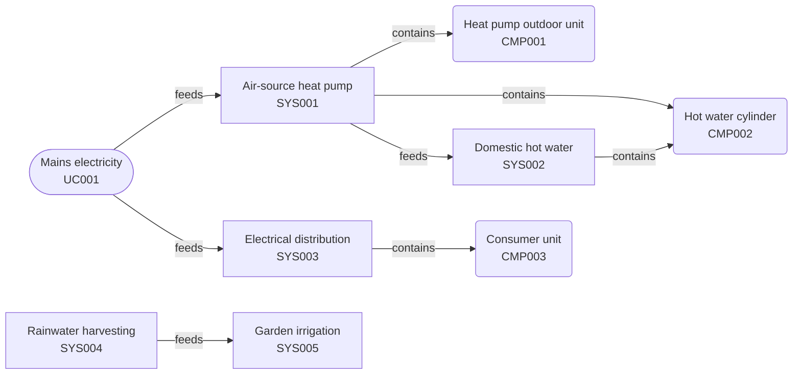

# Willow Cottage

> Generated from a Realm model: 145 entities, 444 relations, 5 planes, Realm schema v2.2.0.

**Willow Cottage, Brackwater Lane, Nether Hollowby, South West England, England**

Fictional smallholding of about 1927 m² on a south-facing hillside. A two-storey rubble-stone cottage of 1868 with a later rear lean-to, a detached stone barn on a lower platform, an orchard and a terraced vegetable garden. Heated by an air-source heat pump; water from the mains, drainage to a septic tank. Used here as the reference example for the Realm schema.

## Where things are

```mermaid
flowchart TD
    LP001["Willow Cottage smallholding<br/>LP001"]
    BLD001["Willow Cottage<br/>BLD001"]
    FLR001["Ground floor<br/>FLR001"]
    RM001["Kitchen<br/>RM001"]
    RM002["Entrance hall<br/>RM002"]
    RM003["Sitting room<br/>RM003"]
    RM004["Dining room<br/>RM004"]
    RM005["Stair hall<br/>RM005"]
    RM006["Study<br/>RM006"]
    RM007["Utility room<br/>RM007"]
    RM008["Cloakroom<br/>RM008"]
    WNG001["Cottage main range<br/>WNG001"]
    FLR002["First floor<br/>FLR002"]
    RM009["Principal bedroom<br/>RM009"]
    RM010["Landing<br/>RM010"]
    RM011["Bedroom two<br/>RM011"]
    RM012["Bathroom<br/>RM012"]
    RM013["Bedroom three<br/>RM013"]
    RM014["Box room<br/>RM014"]
    WNG002["Rear scullery lean-to<br/>WNG002"]
    BLD002["Stone barn<br/>BLD002"]
    WNG003["Stone barn<br/>WNG003"]
    FLR003["Barn floor<br/>FLR003"]
    RM015["Barn bay<br/>RM015"]
    OZ001("Drive<br/>OZ001")
    OZ002("Front garden<br/>OZ002")
    OZ003("South terrace<br/>OZ003")
    OZ004("Orchard<br/>OZ004")
    OZ005("Vegetable garden<br/>OZ005")
    OZ006("Lower meadow<br/>OZ006")
    OZ007("Barn forecourt<br/>OZ007")
    OZ008("Compost corner<br/>OZ008")
    BLD001 --> FLR001
    BLD001 --> WNG001
    BLD001 --> WNG002
    BLD002 --> WNG003
    FLR001 --> RM001
    FLR001 --> RM002
    FLR001 --> RM003
    FLR001 --> RM004
    FLR001 --> RM005
    FLR001 --> RM006
    FLR001 --> RM007
    FLR001 --> RM008
    FLR002 --> RM009
    FLR002 --> RM010
    FLR002 --> RM011
    FLR002 --> RM012
    FLR002 --> RM013
    FLR002 --> RM014
    FLR003 --> RM015
    LP001 --> BLD001
    LP001 --> BLD002
    LP001 --> OZ001
    LP001 --> OZ002
    LP001 --> OZ003
    LP001 --> OZ004
    LP001 --> OZ005
    LP001 --> OZ006
    LP001 --> OZ007
    LP001 --> OZ008
    WNG001 --> FLR002
    WNG003 --> FLR003
```

| Id | Level | Type | Name | Area | Within |
|---|---|---|---|---|---|
| LP001 | 0 | parcel | Willow Cottage smallholding | 1927 m2 | - |
| BLD001 | 1 | building | Willow Cottage | 114.6 m2 | Willow Cottage smallholding (LP001) |
| FLR001 | 2 | floor | Ground floor | 114.6 m2 | Willow Cottage (BLD001) |
| RM001 | 3 | room | Kitchen | 18.5 m2 | Ground floor (FLR001) |
| RM002 | 3 | room | Entrance hall | 15 m2 | Ground floor (FLR001) |
| RM003 | 3 | room | Sitting room | 15 m2 | Ground floor (FLR001) |
| RM004 | 3 | room | Dining room | 15.1 m2 | Ground floor (FLR001) |
| RM005 | 3 | room | Stair hall | 12.2 m2 | Ground floor (FLR001) |
| RM006 | 3 | room | Study | 12.2 m2 | Ground floor (FLR001) |
| RM007 | 3 | room | Utility room | 14.7 m2 | Ground floor (FLR001) |
| RM008 | 3 | room | Cloakroom | 11.9 m2 | Ground floor (FLR001) |
| WNG001 | 2 | wing | Cottage main range | - | Willow Cottage (BLD001) |
| FLR002 | 3 | floor | First floor | 88 m2 | Cottage main range (WNG001) |
| RM009 | 4 | room | Principal bedroom | 18.5 m2 | First floor (FLR002) |
| RM010 | 4 | room | Landing | 15 m2 | First floor (FLR002) |
| RM011 | 4 | room | Bedroom two | 15 m2 | First floor (FLR002) |
| RM012 | 4 | room | Bathroom | 15.1 m2 | First floor (FLR002) |
| RM013 | 4 | room | Bedroom three | 12.2 m2 | First floor (FLR002) |
| RM014 | 4 | room | Box room | 12.2 m2 | First floor (FLR002) |
| WNG002 | 2 | wing | Rear scullery lean-to | - | Willow Cottage (BLD001) |
| BLD002 | 1 | building | Stone barn | 42 m2 | Willow Cottage smallholding (LP001) |
| WNG003 | 2 | wing | Stone barn | - | Stone barn (BLD002) |
| FLR003 | 3 | floor | Barn floor | 42 m2 | Stone barn (WNG003) |
| RM015 | 4 | room | Barn bay | 42 m2 | Barn floor (FLR003) |
| OZ001 | 1 | outdoor_zone | Drive | 69.9 m2 | Willow Cottage smallholding (LP001) |
| OZ002 | 1 | outdoor_zone | Front garden | 210 m2 | Willow Cottage smallholding (LP001) |
| OZ003 | 1 | outdoor_zone | South terrace | 44 m2 | Willow Cottage smallholding (LP001) |
| OZ004 | 1 | outdoor_zone | Orchard | 230 m2 | Willow Cottage smallholding (LP001) |
| OZ005 | 1 | outdoor_zone | Vegetable garden | 159 m2 | Willow Cottage smallholding (LP001) |
| OZ006 | 1 | outdoor_zone | Lower meadow | 177.5 m2 | Willow Cottage smallholding (LP001) |
| OZ007 | 1 | outdoor_zone | Barn forecourt | 38.3 m2 | Willow Cottage smallholding (LP001) |
| OZ008 | 1 | outdoor_zone | Compost corner | 36 m2 | Willow Cottage smallholding (LP001) |

## Buildings and rooms

### Willow Cottage (BLD001)

Two-storey stone cottage with a single-storey rear lean-to, set on a levelled terrace cut into the hillside. The terrace is the model's Z datum.

| Property | Value |
|---|---|
| Type | house |
| Built | 1868 |
| Floors | 2 |
| Area | 114.6 m2 |
| Wings | WNG001, WNG002 |

| Room | Name | Type | Floor | Area | Ceiling | Water | Heating |
|---|---|---|---|---|---|---|---|
| RM001 | Kitchen | kitchen | Ground floor (FLR001) | 18.5 m2 | 245 cm | yes | yes |
| RM002 | Entrance hall | hallway | Ground floor (FLR001) | 15 m2 | 245 cm | no | yes |
| RM003 | Sitting room | living-room | Ground floor (FLR001) | 15 m2 | 245 cm | no | yes |
| RM004 | Dining room | dining-room | Ground floor (FLR001) | 15.1 m2 | 245 cm | no | yes |
| RM005 | Stair hall | staircase | Ground floor (FLR001) | 12.2 m2 | 245 cm | no | no |
| RM006 | Study | office | Ground floor (FLR001) | 12.2 m2 | 245 cm | no | yes |
| RM007 | Utility room | utility | Ground floor (FLR001) | 14.7 m2 | 245 cm | yes | yes |
| RM008 | Cloakroom | bathroom | Ground floor (FLR001) | 11.9 m2 | 245 cm | yes | yes |
| RM009 | Principal bedroom | bedroom | First floor (FLR002) | 18.5 m2 | 235 cm | no | yes |
| RM010 | Landing | hallway | First floor (FLR002) | 15 m2 | 235 cm | no | no |
| RM011 | Bedroom two | bedroom | First floor (FLR002) | 15 m2 | 235 cm | no | yes |
| RM012 | Bathroom | bathroom | First floor (FLR002) | 15.1 m2 | 235 cm | yes | yes |
| RM013 | Bedroom three | bedroom | First floor (FLR002) | 12.2 m2 | 235 cm | no | yes |
| RM014 | Box room | storage | First floor (FLR002) | 12.2 m2 | 235 cm | no | no |

### Stone barn (BLD002)

Detached barn east of the cottage, on its own platform 1.2 m lower. Reached from the drive; no internal connection to the house.

| Property | Value |
|---|---|
| Type | garage |
| Built | 1890 |
| Floors | 1 |
| Area | 42 m2 |
| Wings | WNG003 |

| Room | Name | Type | Floor | Area | Ceiling | Water | Heating |
|---|---|---|---|---|---|---|---|
| RM015 | Barn bay | garage-bay | Barn floor (FLR003) | 42 m2 | 280 cm | no | no |

## Grounds

| Zone | Name | Type | Area | Sun | Slope |
|---|---|---|---|---|---|
| OZ001 | Drive | driveway | 69.9 m2 | full-sun | 12.2% S |
| OZ002 | Front garden | lawn | 210 m2 | full-sun | 12.9% S |
| OZ003 | South terrace | terrace | 44 m2 | full-sun | 14.2% S |
| OZ004 | Orchard | orchard | 230 m2 | full-sun | 12.4% S |
| OZ005 | Vegetable garden | vegetable-garden | 159 m2 | full-sun | 14.2% S |
| OZ006 | Lower meadow | meadow | 177.5 m2 | partial-sun | 13.9% S |
| OZ007 | Barn forecourt | gravel-area | 38.3 m2 | partial-sun | 11.5% S |
| OZ008 | Compost corner | compost-area | 36 m2 | partial-shade | 14.2% S |

### Boundary

| Segment | Name | Type | Length | Borders |
|---|---|---|---|---|
| BS001 | Roadside hedge | hedge-mixed | 34.09 m | - |
| BS002 | North-east post and rail | fence-wood | 22.5 m | Hollybank (north-east) (NP001) |
| BS003 | East stone wall | wall-stone | 25.71 m | The Old Forge (east) (NP002) |
| BS004 | South treeline | natural-treeline | 28.64 m | Mill Farm meadow (south) (NP003) |
| BS005 | West retaining wall | wall-stone | 50.33 m | Brackwater coppice (west) (NP004) |

### Neighbouring property

| Property | Name | Type | Notes |
|---|---|---|---|
| NP001 | Hollybank (north-east) | residential-single | Stone farmhouse uphill to the north-east. Its south roof slope carries panels that face the cottage across the paddock. |
| NP002 | The Old Forge (east) | residential-single | Single-storey conversion of the village forge, occupied at weekends. |
| NP003 | Mill Farm meadow (south) | agricultural | Grazing meadow across the stream, in the same ownership as Mill Farm. No buildings within sight of the cottage. |
| NP004 | Brackwater coppice (west) | forest | Hazel coppice on the west bank, cut on a seven-year rotation. Its edge trees overhang the drive. |

## Systems and utilities

| System | Name | Type | Where | Supply | Parts | Installed |
|---|---|---|---|---|---|---|
| SYS001 | Air-source heat pump | heating | Willow Cottage (BLD001) | Mains electricity (UC001) | CMP001, CMP002 | 2023-03-14 |
| SYS002 | Domestic hot water | hot-water | Utility room (RM007) | - | CMP002 | 2023-03-14 |
| SYS003 | Electrical distribution | electrical-distribution | Utility room (RM007) | Mains electricity (UC001) | CMP003 | - |
| SYS004 | Rainwater harvesting | rainwater-collection | Compost corner (OZ008) | - | - | 2024-05-02 |
| SYS005 | Garden irrigation | irrigation | Vegetable garden (OZ005) | - | - | - |

### Utility connections

| Connection | Name | Type | Provider | Charged to |
|---|---|---|---|---|
| UC001 | Mains electricity | electricity | Westcombe Power | Electricity (CC001) |
| UC002 | Mains water | water-supply | Brackwater Water | Water and drainage (CC002) |
| UC003 | Fibre broadband | fiber-internet | Combe Fibre | Broadband (CC003) |

### Monitoring

| Device | Name | Monitors | Controls | Where |
|---|---|---|---|---|
| IOT001 | Hall thermostat | - | Air-source heat pump (SYS001) | Entrance hall (RM002) |
| IOT002 | Vegetable bed moisture sensor | Garden irrigation (SYS005) | - | Vegetable garden (OZ005) |

## Maintenance schedule

### building (2)

| Task | Name | Target | When | Season | Priority | Duration | Cost | Last done |
|---|---|---|---|---|---|---|---|---|
| MT004 | Gutter and downpipe clear | Willow Cottage (BLD001) | First Saturday in November, every year | autumn | high | 120 min | - | 2025-11-01 |
| MT005 | Retaining wall inspection | West retaining wall (BS005) | Every April | spring | medium | 45 min | - | - |

### infrastructure (1)

| Task | Name | Target | When | Season | Priority | Duration | Cost | Last done |
|---|---|---|---|---|---|---|---|---|
| MT001 | Heat pump annual service | Air-source heat pump (SYS001) | Second Monday in September, every year | autumn | high | 90 min | 180 GBP | 2025-09-08 |

### garden (2)

| Task | Name | Target | When | Season | Priority | Duration | Cost | Last done |
|---|---|---|---|---|---|---|---|---|
| MT002 | Hedge trim | Beech hedge (PTG001) | Third Saturday in August, every year | summer | medium | 240 min | - | 2025-08-16 |
| MT003 | Orchard winter prune | Bramley apple (SPM003) | First Saturday in February, every year | winter | medium | 180 min | - | 2026-02-07 |

### Cost categories

| Category | Name | Annual budget | Charged from the schedule above |
|---|---|---|---|
| CC001 | Electricity | 1740 GBP | 180 GBP |
| CC002 | Water and drainage | 504 GBP | - |
| CC003 | Broadband | 456 GBP | - |

## Planned work

### approved (1)

| Change | Name | Priority | Planned | Affects | Cost |
|---|---|---|---|---|---|
| ECH001 | Rebuild the bulging section of the east wall | high | 2026-10-05 to 2026-10-16 | BS003, OZ004, BS003 | 2400 GBP |

### proposed (1)

| Change | Name | Priority | Planned | Affects | Cost |
|---|---|---|---|---|---|
| ECH002 | Extend rainwater harvesting to the barn roof | low | - | BLD002, SYS004, OZ007, SYS004 | 900 GBP |

### Risks

| Risk | Name | Category | Severity | Status | Threatens | Mitigation |
|---|---|---|---|---|---|---|
| RSK001 | Frost damage to orchard blossom | operational | moderate | monitoring | EF002, OZ004, SPM003, SPM004 | The orchard stops short of the meadow, and the two most exposed trees are the pear and the youngest apple. Fleece is kept for forecast frosts after the first blossom. |

### Open issues

| Issue | Name | Severity | Status | Affects |
|---|---|---|---|---|
| ISS001 | East wall bulging near the south end | moderate | open | BS003, NP002 |

## Context

### People

| Person | Name | Type | Role | Company |
|---|---|---|---|---|
| PRS001 | The owner | owner | Owner-occupier | - |
| PRS002 | Brackwater Heating | service-provider | Heat pump servicing and plumbing | Brackwater Heating Ltd |
| PRS003 | Hollybank household | neighbor | - | - |

### Regulatory requirements

| Requirement | Name | Type | Inspection | Last | Next due | Applies to |
|---|---|---|---|---|---|---|
| REG001 | Fixed electrical installation inspection | electrical-safety | - | 2024-11-12 | 2029-11-12 | BLD001, BLD002, SYS003 |

### Warranties

| Warranty | Name | Manufacturer | From | To | Covers |
|---|---|---|---|---|---|
| WRT001 | Heat pump installation warranty | Northwind | 2023-03-14 | 2030-03-13 | CMP001, CMP002, SYS001, SYS002 |

### Environmental factors

| Factor | Name | Type | Affects | Notes |
|---|---|---|---|---|
| EF001 | South-westerly prevailing wind | prevailing-wind | OZ005, OZ006 | Open fetch across the meadow, so the vegetable garden needs the hedge on its south-west corner. |
| EF002 | Frost pocket in the lower meadow | frost-pocket | OZ004, OZ006 | Cold air drains down the 6.4 m fall and settles at the stream, which is why the orchard stops short of the meadow. |
| EF003 | Erosion on the south-west bank | erosion-risk | OZ005 | The steepest part of the fall crosses the vegetable garden; the terrace risers wash out where they are not planted. |

## Model coverage

9 finding(s) from 4 rule(s). Each names something the schema leaves optional and this model does not say. One example per rule is shown; `realm-check` prints them all.

| Rule | Severity | Findings | Example |
|---|---|---|---|
| planting-without-care-profile | warn | 2 | Planting "PTG002" (Raised vegetable beds) has no care profile - the whole group appears on no maintenance calendar. |
| specimen-without-care-profile | warn | 2 | Specimen "SPM002" (Lane oak) has no care profile - it will appear on no maintenance calendar. |
| system-without-maintenance | info | 3 | System "SYS002" (Domestic hot water) is the target of no maintenance task - it appears on no calendar and in no schedule. |
| system-without-parts | warn | 2 | System "SYS004" (Rainwater harvesting) has no parts recorded - nothing says what it is made of. |

## Catalogue

| Plane | Entities |
|---|---|
| context | 13 |
| infrastructure | 16 |
| nature | 12 |
| operations | 10 |
| topology | 88 |
| (cross-cutting) | 6 |

| Type | Count | Plane |
|---|---|---|
| room | 15 | topology |
| outdoor_zone | 8 | topology |
| boundary_segment | 5 | topology |
| maintenance_task | 5 | operations |
| system | 5 | infrastructure |
| neighbor_property | 4 | context |
| specimen | 4 | nature |
| component | 3 | infrastructure |
| cost_category | 3 | operations |
| environmental_factor | 3 | context |
| floor | 3 | topology |
| person | 3 | context |
| planting | 3 | nature |
| utility_connection | 3 | infrastructure |
| wing | 3 | topology |
| building | 2 | topology |
| estate_change | 2 | - |
| event | 2 | - |
| iot_device | 2 | infrastructure |
| network_node | 2 | infrastructure |
| road_corridor | 2 | context |
| soil_profile | 2 | nature |
| species_care_profile | 2 | nature |
| biomass_flow | 1 | nature |
| issue | 1 | - |
| network_link | 1 | infrastructure |
| parcel | 1 | topology |
| regulatory_requirement | 1 | operations |
| risk | 1 | - |
| shared_concern | 1 | context |
| warranty | 1 | operations |

94 authored entities, 51 derived.

51 further entities form the construction layer (43 wall_segment, 5 roof_plane, 2 floor_slab, 1 ceiling_slab). They are derived from the rooms, wings and floors above rather than authored, and are summarised rather than listed - pass --geometry to enumerate them.
